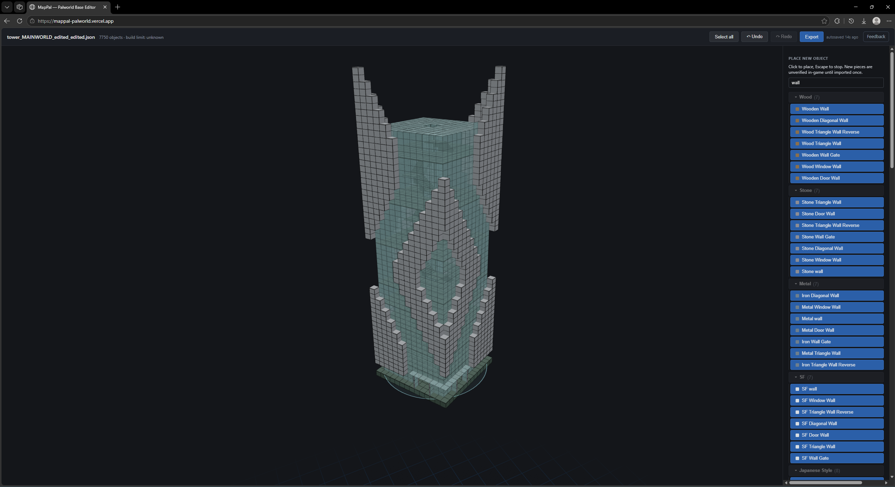
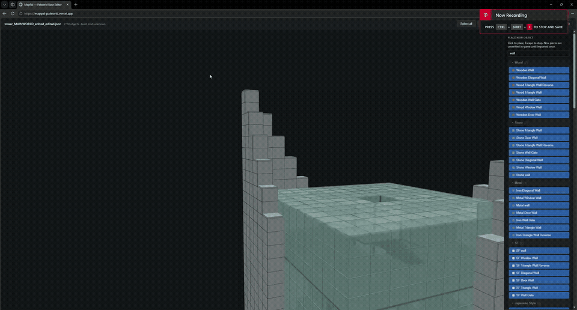
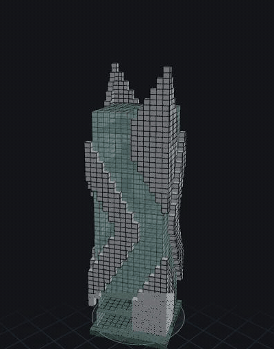
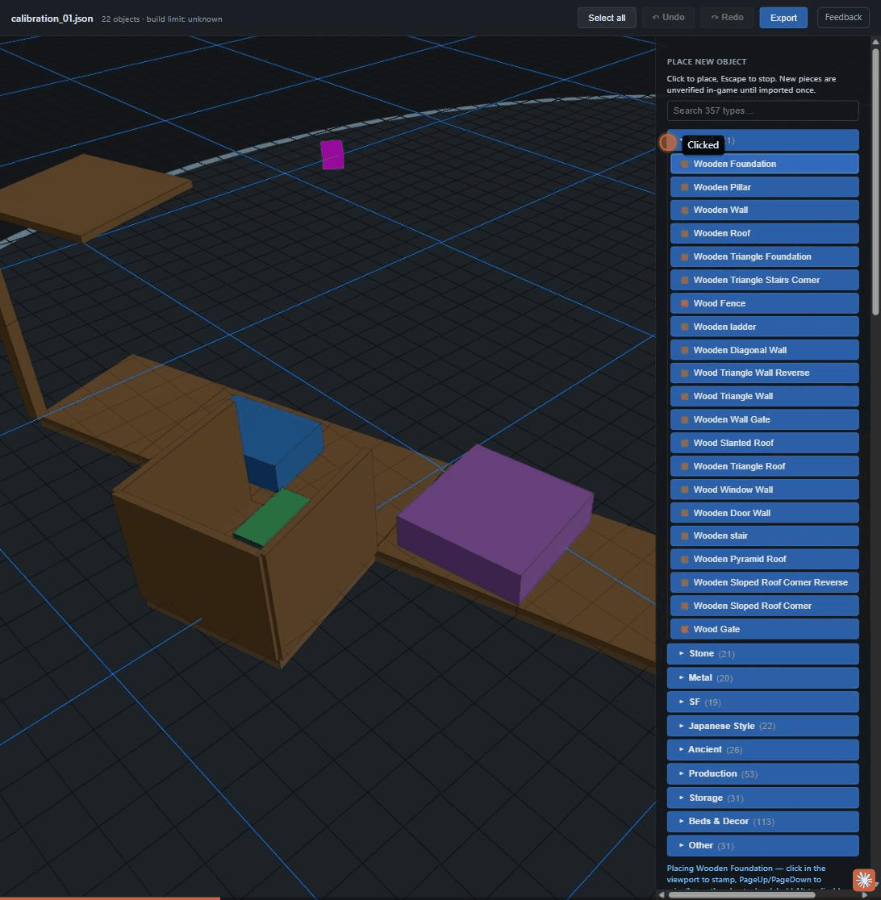

# MapPal — Palworld Base Blueprint Editor

**Use it now: [mappal-palworld.vercel.app](https://mappal-palworld.vercel.app)** — no install, no signup required, runs entirely in your browser. Your files never leave your machine unless you explicitly publish a base to the community gallery. (The app reports anonymous usage signals — feature counts and errors, via PostHog — but never blueprint contents.)


*A ~7,700-piece skyscraper designed in MapPal and imported into a live world — the glass-and-cladding facade was generated from the original build guide's plan graphic.*


*Box-select a whole region and mass-edit it — one of the fill/stack/duplicate tools that make 7,000-piece builds practical.*

<p align="center">
  
  &nbsp;&nbsp;
  
</p>

*Left: per-level hide/solo peels the 7,700-piece tower floor by floor — work on any interior level without the building in the way. Right: the Base Circle generator fills a full circular platform in one click.*

> ## ⚠️ Back up your save first
> Before importing anything this tool produced, copy your world folder
> (`%LOCALAPPDATA%\Pal\Saved\SaveGames\<SteamID>\<WorldID>`) somewhere safe.
> Palworld also keeps rolling backups in each world's `backup\world\` folder —
> know where they are before you need them.

A browser-based 3D editor for Palworld base layouts. Load a base blueprint
exported by PalworldSaveTools, move/rotate/duplicate/delete objects in a 3D
scene, export a blueprint PST can import back. Built for planning mega-bases
out of game.

**MapPal never touches a `.sav` file.** All save I/O is done by
[PalworldSaveTools](https://github.com/deafdudecomputers/PalworldSaveTools)
(PST) by deafdudecomputers — MapPal only reads and writes PST's blueprint
JSON. Schema understanding builds on the GVAS structure work in
[palworld-save-tools](https://github.com/cheahjs/palworld-save-tools) by cheahjs.

## Workflow

1. **Export**: PST → load your world's `Level.sav` → Map Viewer → right-click
   your base → *Export Base* → save as **plain `.json`** (not `.pstbase`).
2. **Edit**: open MapPal, drag the `.json` in. Click to select (shift-click /
   shift-drag to add), arrow keys move on the base's snap grid, PgUp/PgDn
   change height, Q/E rotate 90°, Ctrl+D duplicates, Delete removes,
   Ctrl+Z/Y undo/redo. Hold right-mouse for a Unity-style fly camera
   (WASD + Q/E). The full cheat sheet lives in the sidebar.

   **Mass-building tools** (this is where the tool earns its keep):
   - Place any of the game's 453 buildable piece types from the palette,
     snapped the way the game snaps (walls on edges, pillars on corners,
     wall-top capping)
   - Shift+click fills a line of pieces; Ctrl+Shift+click fills a rectangle
   - One-click circular platform generator sized to the base radius
   - Vertical stacking (whole columns of walls in one action)
   - Shift+Q/E rotates a selection around the palbox — build one wing,
     copy it to the other three sides
   - Autosave every 20s with session restore; an export linter checks the
     file's internal references before every download
3. **Export**: the Export button downloads `<name>_edited.json`.
4. **Import**: close Palworld completely → PST → load the **destination**
   world → Map Viewer → right-click → *Import Base* → pick the file →
   **save in PST** → close PST → launch the game.

### The three rules (each one learned the hard way)

- **Never import into the world the export came from.** The game silently
  deletes the imported structures on next load (PST leaves the imported
  work-data bound to the original base's ID). Export from world A, import
  into world B. Your main world can be the destination — an import only
  *adds* a base, it never resets anything.
- **The game must be fully closed** whenever PST saves. A running game
  ignores the change and overwrites it on its next save.
- **Imports land ~80 m away from the blueprint's original coordinates**
  (collision-avoided), as a new base. Look for the new palbox on the map.

## Community gallery

Sign in (Discord or GitHub) to **publish a base** to a public gallery anyone
can browse and open straight in the editor, or **save bases privately** to
your account. Before anything uploads, the publish dialog shows exactly what
the file contains beyond the build (player IDs, pal entries) — nothing is
sent until you click Publish. Full architecture and privacy notes:
[docs/GALLERY.md](docs/GALLERY.md).

## Status

v0.2 — the full loop (load → edit → export → PST import → verified in-game)
works, including placing *new* objects from a palette covering all 453
buildable types (cloned from real exports, not synthesized from scratch —
see `CLAUDE.md` §6). Verified in-game at scale: a ~7,700-piece editor-built
skyscraper imported and spawned intact. Tested against PST v2.1.0 on Palworld
v1.0.1 (Steam). Derived format ground truth lives in `docs/CALIBRATION.md`.

## Known limitations

- **No terrain.** There's no heightmap — the ground plane is a flat grid, not
  your actual landscape. Your existing foundations are the elevation
  reference; there's nothing to snap new pieces to the terrain itself.
- **Palette placement is donor-limited.** You can only place object types
  that have been harvested from a real export at least once. Missing a type
  you need? Export a base that has it and open a GitHub issue with the file —
  that's literally how the palette grows.
- **Desktop, WebGL browser required.** No mobile/touch support. Tested on
  Chrome; other Chromium/Firefox browsers should work but haven't been
  checked as thoroughly.
- **"Build limit: unknown" is intentional, not broken.** The game enforces a
  build cap we haven't derived yet, so the header says so honestly instead of
  guessing — see the guardrails note in `CLAUDE.md` §5.
- **Large files can be slow to drag-and-drop through some tools/OSes**, but
  the editor itself has been tested with ~7,700-object bases without issue.
- **Verified against PST v2.1.0 + Palworld v1.0.1 (Steam) specifically.**
  PST's export format is undocumented and could change between releases; the
  loader fails loudly rather than guessing if the shape drifts.

## Development

**How it was built:** the full build log — calibration-first process, the donor
pattern, and the same-world import incident — is in [docs/BUILDLOG.md](docs/BUILDLOG.md).

```
npm install
npm run dev        # editor at http://localhost:5173
npm test           # incl. round-trip fidelity tests against fixtures/
npm run inspect <file.json>   # schema-agnostic blueprint dumper
```

Stack: Vite, TypeScript (strict), React, @react-three/fiber, zustand, vitest.

## Credits

- [PalworldSaveTools](https://github.com/deafdudecomputers/PalworldSaveTools)
  (deafdudecomputers) — the save-editing toolkit MapPal depends on for all
  save I/O; its Export/Import Base feature defines the blueprint format.
- [palworld-save-tools](https://github.com/cheahjs/palworld-save-tools)
  (cheahjs) — the community-standard GVAS parser underpinning the ecosystem.
- Not affiliated with Pocketpair. No game assets are included in this
  repository.

## License

[MIT](LICENSE)
